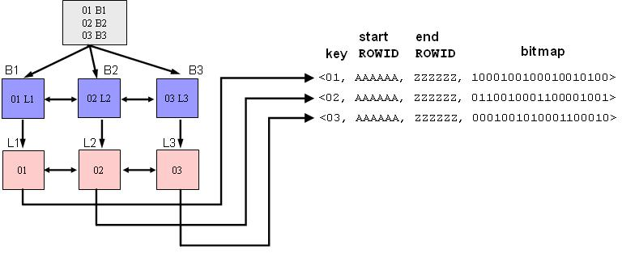
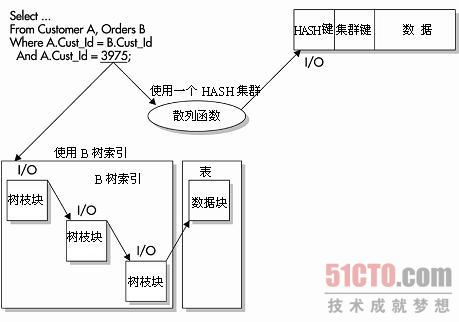
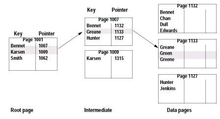
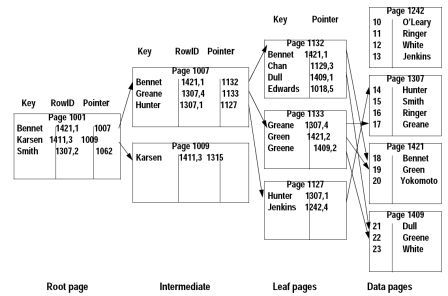

### ORACLE 索引原理

- 博客分类：

-  

- [DataBase](https://www.iteye.com/category/169723)

 

**（本文内容均整理自万能的INTERNET）**

- **B-TREE索引**

一个B树索引只有一个根节点，它实际就是位于树的最顶端的分支节点。

可以用下图一来描述B树索引的结构。其中，B表示分支节点，而L表示叶子节点。

  对于分支节点块（包括根节点块）来说，其所包含的索引条目都是按照顺序排列的（缺省是升序排列，也可以在创建索引时指定为降序排列）。每个索引条目（也可以叫做每条记录）都具有两个字段。第一个字段表示当前该分支节点块下面所链接的索引块中所包含的最小键值；第二个字段为四个字节，表示所链接的索引块的地址，该地址指向下面一个索引块。在一个分支节点块中所能容纳的记录行数由数据块大小以及索引键值的长度决定。比如从上图一可以看到，对于根节点块来说，包含三条记录，分别为（0 B1）、（500 B2）、（1000 B3），它们指向三个分支节点块。其中的0、500和1000分别表示这三个分支节点块所链接的键值的最小值。而B1、B2和B3则表示所指向的三个分支节点块的地址。

  对于叶子节点块来说，其所包含的索引条目与分支节点一样，都是按照顺序排列的（缺省是升序排列，也可以在创建索引时指定为降序排列）。每个索引条目（也可以叫做每条记录）也具有两个字段。第一个字段表示索引的键值，对于单列索引来说是一个值；而对于多列索引来说则是多个值组合在一起的。第二个字段表示键值所对应的记录行的ROWID，该ROWID是记录行在表里的物理地址。如果索引是创建在非分区表上或者索引是分区表上的本地索引的话，则该ROWID占用6个字节；如果索引是创建在分区表上的全局索引的话，则该ROWID占用10个字节。

 

- **bitmap索引**

   位图（bitmap）索引是另外一种索引类型，它的组织形式与B树索引相同，也是一棵平衡树。与B树索引的区别在于叶子节点里存放索引条目的方式不同。从前面我们知道，B树索引的叶子节点里，对于表里的每个数据行，如果被索引列的值不为空的，则会为该记录行在叶子节点里维护一个对应的索引条目。
而位图索引则不是这样，其叶子节点里存放的索引条目如下图所示。

  假设某个表T里所有的记录在列C1上只具有三个值：01、02和03。在表T的C1列上创建位图索引以后，则叶子节点的内容如图9-14所示。可以看到，位图索引只有三个索引条目，也就是每个C1列的值对应一个索引条目。位图索引条目上还包含表里第一条记录所对应的ROWID以及最后一条记录所对应的ROWID。索引条目的最后一部分则是由多个bit位所组成的bitmap，每个bit位就对应一条记录。

​    当发出where c1='01'这样的SQL语句时，oracle会去搜索01所在的索引条目，然后扫描该索引条目中的bitmap里所有的bit位。第一个bit位为1，则说明第一条记录上的C1值为01，于是返回第一条记录所在的ROWID（根据该索引条目里记录的start ROWID加上行号得到该记录所在的ROWID）。第二个bit位为0，则说明第二条记录上的C1值不为01，依此类推。另外，如果索引列为空，也会在位图索引里记录，也就是将对应的bit位设置为0即可。
​    如果索引列上不同值的个数比较少的时候，比如对于性别列（男或女）等，则使用位图索引会比较好，因为它对空间的占用非常少（因为都是用bit位来表示表里的数据行），从而在扫描索引的时候，扫描的索引块的个数也比较少。可以试想一下，如果在列的不同值非常多的列上，比如主键列上，创建位图索引，则产生的索引条目就等于表里记录的条数，同时每个索引条目里的bitmap里，只有一个1，其它都是0。这样还不如B树索引的效率高。
如果被索引的列经常被更新的话，则不适合使用位图索引。因为当更新位图所在的列时，由于要在不同的索引条目之间修改bit位，比如将第一条记录从01变为02，则必须将01所在的索引条目的第一个bit位改为0，再将02所在的索引条目的第一个bit位改为1。因此，在更新索引条目的过程中，会锁定位图索引里多个索引条目。也就是同时只能有一个用户能够更新表T，从而降低了并发性。
位图索引比较适合用在数据仓库系统里，不适合用在OLTP系统里。

 

- **HASH索引**

   使用HASH索引必须要使用HASH集群。建立一个集群或HASH集群的同时，也就定义了一个集群键。这个键告诉Oracle如何在集群上存储表。在存储数据时，所有与这个集群键相关的行都被存储在一个数据库块上。如果数据都存储在同一个数据库块上，并且将HASH索引作为WHERE子句中的确切匹配，Oracle就可以通过执行一个HASH函数和I/O来访问数据-- 而通过使用一个二元高度为4的B树索引来访问数据，则需要在检索数据时使用4个I/O。如图2-5所示，其中的查询是一个等价查询，用于匹配HASH列和确切的值。Oracle可以快速使用该值，基于HASH函数确定行的物理存储位置。

   HASH索引可能是访问数据库中数据的最快方法，但它也有自身的缺点。集群键上不同值的数目必须在创建HASH集群之前就要知道。需要在创建HASH集群的时候指定这个值。低估了集群键的不同值的数字可能会造成集群的冲突(两个集群的键值拥有相同的HASH值)。这种冲突是非常消耗资源的。冲突会造成用来存储额外行的缓冲溢出，然后造成额外的I/O。如果不同HASH值的数目已经被低估，您就必须在重建这个集群之后改变这个值。ALTER CLUSTER命令不能改变HASH键的数目。

   HASH集群还可能浪费空间。如果无法确定需要多少空间来维护某个集群键上的所有行，就可能造成空间的浪费。如果不能为集群的未来增长分配好附加的空间，HASH集群可能就不是最好的选择。

如果应用程序经常在集群表上进行全表扫描，HASH集群可能也不是最好的选择。由于需要为未来的增长分配好集群的剩余空间量，全表扫描可能非常消耗资源。

 

在实现HASH集群之前一定要小心。您需要全面地观察应用程序，保证在实现这个选项之前已经了解关于表和数据的大量信息。通常，HASH对于一些包含有序值的静态数据非常有效。

技巧：

HASH索引在有限制条件(需要指定一个确定的值而不是一个值范围)的情况下非常有用。

 

- **聚族索引**

   在这里还是用字典来进行类比，一般来说汉语字典中有几种索引，如拼音、偏旁、笔画等。字典本身的组织也是排序的，我记得一般是按照拼音排序的。这里的拼音就是聚族索引。也就是说聚族索引的组织顺序和数据本身的组织顺序是一致的 ，这也解释了数据库中只能定义一个聚族索引的原因，因为数据本身只能按一种方式进行排序。
   那聚族索引有什么特别的好处呢，这个好处就是在数据库中执行查找一批数据的语句会比较快，因为数据已经按照聚族索引排好序了，很少的io操作就可以将数据从库中取出。好比你在字典中查找发音从从a到c的汉字，只需要查到a的开始页和c的结束页，中间的所有页都符合查询要求，不用再一页一页地查找。

 

 

- **非聚族索引**

   非聚族索引就好比字典里的偏旁、笔画索引，其 索引组织顺序和数据组织顺序不一致 ，因此非聚族索引可以创建多个。当查找一条数据时，非聚族索引和聚族索引的效率相差不大，但查找一批数据(n)时，非聚族索引需要的io可能是聚族索引的n倍，因为非聚族索引需要一条一条地进行查找。

